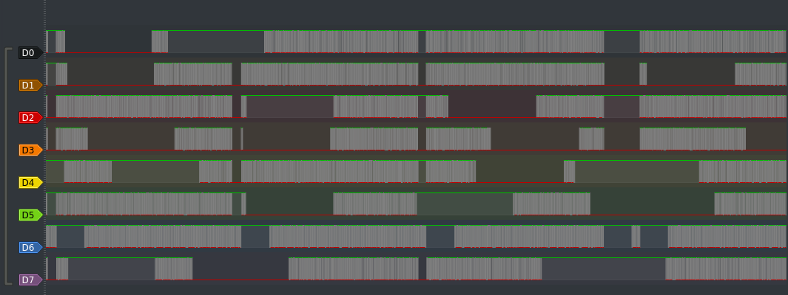

# EmSys Lab1
Welcome to the first EmSys Labs.

This lab consists of a number of exercises:
* _"What is your secret word?"_ -- where you will use pulseview to determine the secret word your ESP32 is transmitting. 
* _"Hello World!"_  -- where you will program your ESP32 to send a UART message of your own.
* _"Square Wave Generator"_ -- where you will generate square waves as fast as you can and calculate the arduino library overheads.
* _"dotDevice"_ -- where you will interact with your virtual dotDevice on the centralised emSys webserver via WebSockets.
 
This lab aims to familiarise you with:
* The Arduino IDE and it's overheads
* Capturing waveforms from the logic analyser in PulseView
* Timing issues in embedded systems
* WebSockets and communications between embedded devices


### Useful Acronyms and Terms
| Acronym/Term | Meaning        |
|---------|----------------|
| LA      | Logic Analyser      |
| GPIO    | General Purpose Input Output |
| UART    | Uniersal Asynchronous Receiver-Transmitter |

----------------------------
### Submission guide
__TODO:__ _logbook format_

### How your LA and ESP32 are connected
__TODO:__ _Include a diagram showing the wiring between the LA and ESP32_

-----------------------------
### What is your secret word?
All the ESP32 devices in the lab have been preloaded with a program that is sending a unique word for each group over some UART pins. Your task here is to find out what your groups unique word is using your LA and PulseView.

1. Open PulseView ```pulseview``` and capture a trace. [[video guide: capturing a trace with pulseview](https://youtu.be/nhTuqYAT4OI)]

Your trace should look something similar to this.


2. Examine the signals on your waveform, try and identify which signals you think might be a UART Tx signal. All the other signals are randomly changing. The UART Tx channel will be regularly repeating the same word in ASCII. 
3. Using the PulseView low-level protocol decoder decode the signal that you think is trasmitting your secret word. [[video guide: using the pulseview low-level protocol decoder](https://youtu.be/hBrg0VJTNWA)].
4. Write your secret word in your logbook.

_Tips_: 
* _Only common Baud rates are used. The UART Tx pin will be transimitting on only one of these 9600, 38400, and 115200_
* _You do not know the baud rate of the signal you are trying to intercept, this may require trial and error to find the correct parameter_
* _However, you have 8 data bits, and no parity bits._

UART was discussed in the first lecture briefly, if you'd like to review the first lecture the recording is available [[here](https://swanseauniversity.zoom.us/rec/share/R7U9ldmf8-D5dC1GzypI1Fmygk_uMk0AHLJSNAJh9jKzSaDWy91D_K8dqezqFnjf.dxRs8jgIIbZQ9eEK )] ``<passcode: Rq7!2vJ7>```. 

### Hello World! 

--------------------
### Square Wave Generator

Next you are going to use Arduino to generate square waves from your device and measure the maximum possible frequency. In the second lecture there I explained the following which will be useful for this lab:
* The basic structure of an Arduino sketch i.e. what the ``setup()`` and ``loop()`` functions do.
* How to drive an output pin ``HIGH`` and ``LOW`` using ``digitalWrite()`` [[Arduino digitalWrite documentation](https://www.arduino.cc/reference/en/language/functions/digital-io/digitalwrite/)].
* How to make your tinyPico wait using ``delay()`` and ``delayMicroseconds()`` [[Arduino Delay Documentation](https://www.arduino.cc/reference/en/language/functions/time/delay/)].
* What a pointer, the address map of the TinyPico, and how we interact with hardware through pointers.

If you missed the lecture or want to recap these, the recording is available [[here]()] ``<passcode: >``.
Now you will put all that knowledge to good use.

1. Using ```digitalWrite(pin, HIGH|LOW)``` write code to generate a square wave with the highest frequency you possible can. 
2. Using your LA measure this maximum frequency and report it in your logbook. 
3. Do you notice anything unusual about the output? Run a resonable length capture to maybe see something strange (1M samples at 24MHz). Comment on what you think might be causing this?
4. Modify your code above to generate two square waves with as fast a frequency as possible. What is the new maximum frequency? If it has changed comment on why you think that is the case?
5. Using the captured trace from 4. (the item above), estimate the time a ```digitalWrite()``` function call takes, and estimate the ```loop()``` overheads.
6. Use your estimates to calculate what you expect the maximum frequency can be when generating three square waves.
7. Modify your code to generate three square waves and measure the maximum possible frequency, how close was your estimation in 6.?

The Arduino IDE abstracts the underlying hardware with functions such as ```digitalWrite()```. These abstractions are useful, they make it easier for the developer to use, and they allow for the same API to be used on multiple different devices. However, such abstractions come at a cost in terms of performance. 
If we dive a little bit deeper, then we can improve the maximum frequency of our generator.

In the last lecture we examined the address map of our TinyPico device and how we can use pointers to manipulate and interact with hardware. In the next challenge instead of using the Arduino function calls to interact with the GPIO pins, I want you to use pointers to directly interact with the hardware.

To interact with the GPIO  

In the [ESP32 Technical Reference Manual](https://www.espressif.com/sites/default/files/documentation/esp32_technical_reference_manual_en.pdf) you will find the description of three registers that can be used to control the GPIO pins. 

```
        REG_WRITE( <register address>, <BITS>);

```
TODO:
* get the maximum freq using register manipulation
* calculate the arduino overheads 

----------------------
### dotDevice -- Communicating with other embedded systems
